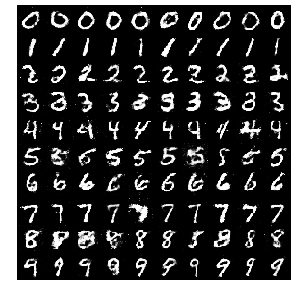
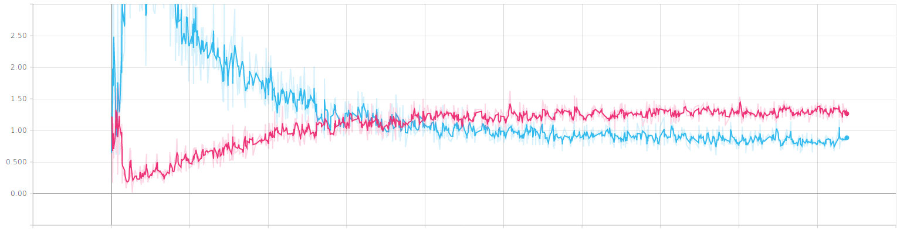

# Pytorch Conditional GAN

This is a pytorch implementation of [Conditional Generative Adversarial Nets](https://arxiv.org/abs/1411.1784), partially based on [this nice implementation](https://github.com/eriklindernoren/PyTorch-GAN/blob/master/implementations/cgan/cgan.py) by [eriklindernoren](https://github.com/eriklindernoren). The generator and the discriminator are simple MLP and I trained for only 50 epochs, so the results are not that good:

I used [tensorboardX](https://github.com/lanpa/tensorboardX) to monitor the training process:

